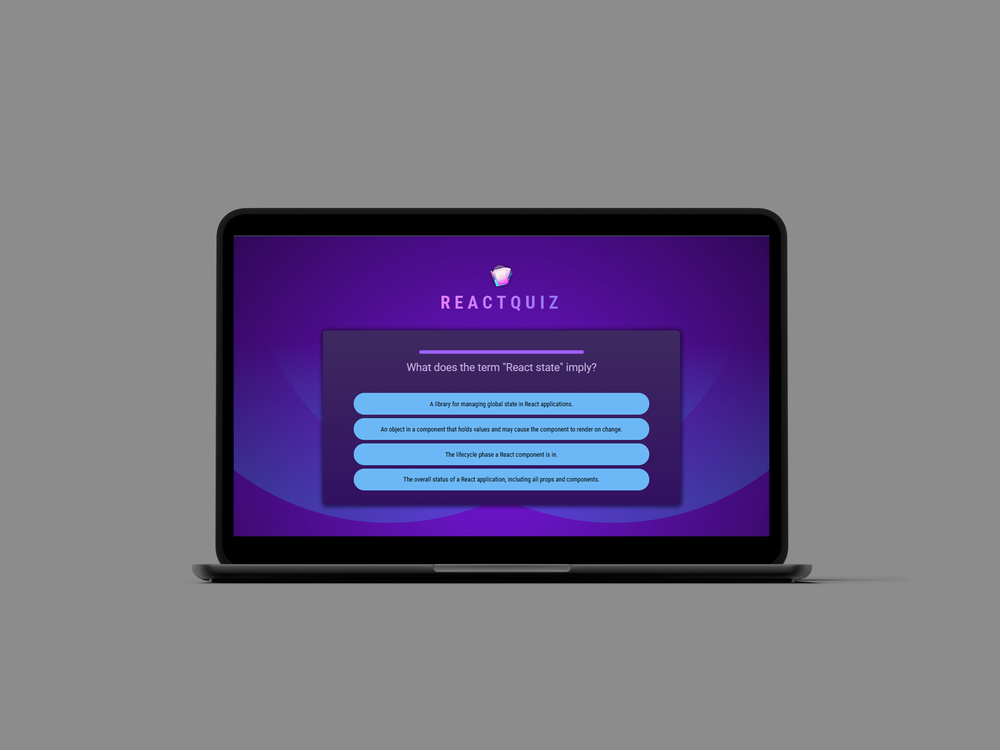

# **ReactQuiz: Interactive Quiz Application**

## Table of Contents

-   [Description](#description)
-   [KeyFeatures](#key-features)
-   [TechnicalHighlights](#technical-highlights)
-   [ProjectStructure](#project-structure)
-   [Conclusion](#conclusion)

**Live demo** [click here](https://quiz-for-react-app.netlify.app/)

---



### **Description:**

ReactQuiz is an engaging quiz application developed using React.js. The app challenges users with timed questions, providing an interactive and dynamic user experience. At the end of the quiz, users receive a detailed summary of their performance, including scores and answer statistics.

---

### **Key Features:**

1. **Timed Questions:**

    - Each question has a limited time for the user to answer.
    - If the timer runs out, the question is automatically skipped.

2. **Real-Time Progression:**

    - Automatically moves to the next question upon answering or skipping.

3. **Performance Summary:**

    - Displays the correctness of each question (correct, wrong, skipped).
    - Provides a total score and percentage breakdown of skipped, wrong, and correct answers.

4. **User-Friendly Interface:**
    - Clean and intuitive design to enhance user engagement.
    - Clear indications of time remaining and question status.

---

### **Technical Highlights:**

-   **React Features Used:**
    -   **State Management:** Manages question, timer, and score data efficiently.
    -   **Ref:** Tracks and manipulates the quiz timer dynamically.
    -   **Effect:** Handles side effects such as updating the timer and transitioning between questions.
    -   **useCallback:** Optimizes performance by memoizing functions to prevent unnecessary re-renders.

---

### **Project Structure:**

```
node_modules
public
src
├── assets                # Static assets (e.g., images, icons, etc.)
├── components            # Reusable React components
│   ├── Answers.jsx       # Handles displaying and selecting answers
│   ├── Header.jsx        # Displays the quiz header and title
│   ├── Question.jsx      # Displays the current question
│   ├── QuestionTimer.jsx # Manages and displays the timer for each question
│   ├── Quiz.jsx          # Main quiz logic and layout
│   ├── Summary.jsx       # Displays the performance summary at the end
├── App.jsx               # Root component, organizes and renders the app
├── index.css             # Global styling for the application
├── main.jsx              # Entry point for rendering the React app
└── question.js           # Data structure or logic for managing quiz
index.html
```

---

### **Conclusion:**

ReactQuiz combines React's powerful hooks with a modular project structure to deliver a dynamic and interactive quiz experience. The clean folder organization ensures scalability and maintainability, making it a great example of modern front-end development practices.
